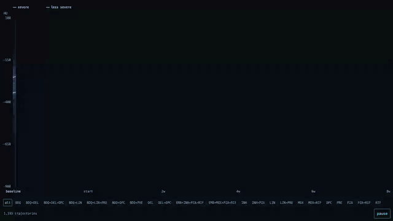
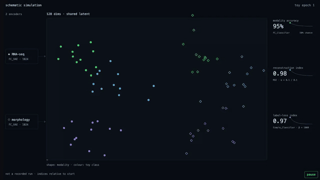
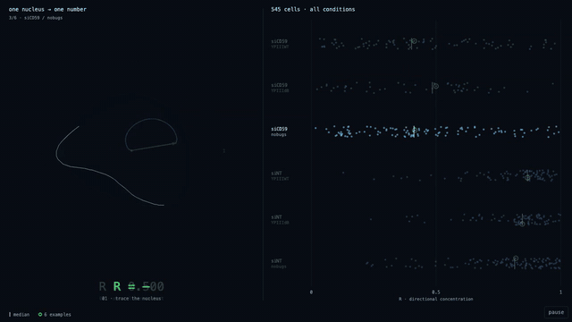

jjw.sh · vol. 1 · 2026 · open access

# josh whiteley

**phd candidate, biomedical engineering** · aldridge lab, tufts university

[jjw.sh](https://jjw.sh) · [google scholar](https://scholar.google.com/citations?user=RDEMzCwAAAAJ&hl) · [orcid](https://orcid.org/0009-0009-3358-0391) · [linkedin](https://linkedin.com/in/joshuawhiteley)

---

### abstract

i research tuberculosis regimen design. my work uses modeling to identify optimal treatment regimens for people with tuberculosis, connecting in vitro measurements (imaging, transcriptomics and drug response) to how treatment plays out in vivo.

**keywords:** tuberculosis · regimen design · machine learning · image analysis

---

### figures

**figure 1. one baseline, many trajectories.** each line follows one lesion across imaging visits: 1,193 trajectories across 22 regimens, coloured by baseline severity. a common starting class does not mean a common course. *contribution:* i clustered baseline imaging into severity classes and built sequential random-forest models with in vitro dormancy features. — Whiteley et al., *bioRxiv* 2026 [[paper]](https://doi.org/10.64898/2026.05.13.724664) [[code]](https://github.com/joshwhiteley/marmoset-paper)

**figure 2. two modalities, one latent space.** DECIPHAER merges transcriptional and morphological data into one latent space: encoders learn to hide which modality a point came from, while a label classifier keeps drug classes distinct. schematic simulation. *contribution:* i developed the modeling: the autoencoders and the adversarial training that merges the modalities. — Johnson, …, Whiteley, …, Aldridge, *Cell Systems* 2025 [[paper]](https://doi.org/10.1016/j.cels.2025.101348) [[code]](https://github.com/wjohnsonTufts/deciphaer)

**figure 3. when a signal takes sides.** the signal around each segmented nucleus becomes one number, R, the intensity-weighted circular resultant length. R = 0 means evenly spread; R = 1 means entirely on one side. *contribution:* i wrote the image analysis: nucleus segmentation, the perinuclear region, the R metric and the figure. — Davis, …, Whiteley, Aldridge, Isberg, *Scientific Reports* 2026 [[paper]](https://www.nature.com/articles/s41598-026-65480-x) [[code]](https://github.com/joshwhiteley/signal-aggregation-comparison)

---

### references

1. **Whiteley JJ**, …, Aldridge B. In vitro dormancy models improve ability to predict treatment response in severe marmoset tuberculosis lesions. *bioRxiv* (2026). [doi](https://doi.org/10.64898/2026.05.13.724664)
2. Davis K, …, **Whiteley JJ**, Aldridge B, Isberg R. Host CD59 potentiates the type III secretion system in *Yersinia pseudotuberculosis*. *Scientific Reports* (2026). [article](https://www.nature.com/articles/s41598-026-65480-x)
3. Johnson W, …, **Whiteley JJ**, …, Aldridge B. Integration of multi-modal measurements identifies critical mechanisms of tuberculosis drug action. *Cell Systems* (2025). [doi](https://doi.org/10.1016/j.cels.2025.101348)
4. Tiwari S, …, **Whiteley JJ**, …, Bhargava R. INFORM: INFrared-based ORganizational Measurements of tumor and its microenvironment to predict patient survival. *Science Advances* (2021). [doi](https://doi.org/10.1126/sciadv.abb8292)

---

### code availability

analysis code for figures 1–3 is public: [marmoset-paper](https://github.com/joshwhiteley/marmoset-paper) · [deciphaer](https://github.com/wjohnsonTufts/deciphaer) · [signal-aggregation-comparison](https://github.com/joshwhiteley/signal-aggregation-comparison). interactive versions of each figure are at [jjw.sh](https://jjw.sh).

### supplementary material

side projects, peer review not required:

- [czi-viewer](https://github.com/joshwhiteley/czi-viewer): a CZI microscopy viewer that works over SSH.
- [fsearch](https://github.com/joshwhiteley/fsearch): fast, Alfred-style file search for the macOS terminal.
- [herdr-remote](https://github.com/joshwhiteley/herdr-remote): monitor and drive herdr agents from the menu bar, a phone or Telegram.

### acknowledgments

the author thanks Bree Aldridge and the Aldridge lab. special thanks to **donut** (cat), who supervised much of this work from the keyboard and is not responsible for any typos.

**competing interests:** cars and travel.
